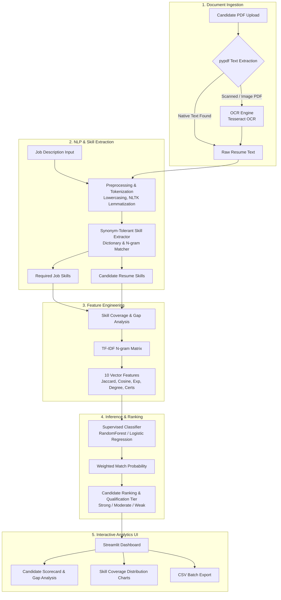

# Talent Lens — Competency-Focused Resume Screening System

[](https://python.org)
[](https://streamlit.io)
[](https://scikit-learn.org)
[](https://docker.com)
[](LICENSE)
[](https://huggingface.co/spaces)

---

## Executive Summary & Domain Context

**Talent Lens** is an enterprise-grade decision support platform engineered for competency-focused resume screening and applicant ranking. Modern talent acquisition faces critical bottlenecks: processing thousands of unstructured PDF resumes while maintaining objectivity, compliance, and speed.

Talent Lens solves this challenge by pairing multi-engine Document Ingestion (featuring PDF text extraction and fallback Tesseract OCR) with transparent Feature Engineering and Supervised Machine Learning. Rather than relying on black-box heuristics, Talent Lens quantifies candidate-job alignment using skill coverage ratios, TF-IDF cosine similarity, Jaccard distance, experience extraction, and education matching.

> [!IMPORTANT]
> **Responsible AI Commitment**: Talent Lens functions purely as an **objective decision-support tool** for human recruitment specialists. It explicitly avoids using demographic attributes or proxies for protected characteristics. Final employment decisions must remain under human oversight.

---

## System Architecture & Workflow

The pipeline ingests raw job descriptions and candidate resumes in PDF format, performs text extraction with automated OCR fallbacks, extracts skill matrices, computes 10 multi-dimensional features, runs inference via an optimized ensemble model, and renders interactive analytics in Streamlit.



---

## Key Features & Capabilities

- 📄 **Multi-Format Ingestion**: Supports direct text input as well as native and scanned PDF upload via `pypdf`, `pypdfium2`, and OCR fallback engines.
- 🎯 **Domain-Aware Skill Extraction**: Extracts technical and soft skills using an extensible dictionary with synonym-tolerant n-gram matching.
- 📐 **Transparent Feature Vectorization**: Computes 10 quantitative match indicators:
  - Required skills count
  - Matched skills count
  - Missing skills count
  - Skill match ratio
  - Jaccard similarity coefficient
  - TF-IDF Cosine similarity
  - Years of experience heuristic
  - Higher education degree match
  - Professional certification count
  - Document text length
- 🤖 **Supervised Model Selection**: Evaluates model candidates (Random Forest Classifier & Logistic Regression with Class Balancing) during training and auto-selects the optimal performer based on weighted F1 score.
- 📊 **Interactive Talent Dashboard**: Visualizes candidate rankings, skill gap metrics, and feature breakdowns with exportable CSV scorecards.

---

## Qualification Tiers & Feature Matrix

### Qualification Tier Breakdown

| Tier | Match Score Range | Label | Description | Recommended HR Action |
| :--- | :--- | :--- | :--- | :--- |
| 🟢 **Tier 1** | `Score >= 0.70` | **Strong Match** | High skill coverage, relevant experience, degree/certs match. | Fast-track for interview screening. |
| 🟡 **Tier 2** | `0.45 <= Score < 0.70` | **Moderate Match** | Partial skill overlap; core capabilities present with minor gaps. | Review candidate portfolio / supplementary experience. |
| 🔴 **Tier 3** | `Score < 0.45` | **Weak Match** | Substantial skill deficit or mismatch with primary criteria. | Retain in talent pool for future aligned roles. |

### Extracted Feature Dimensions

| Feature Name | Data Type | Description |
| :--- | :--- | :--- |
| `required_skills` | `float` | Count of distinct key skills identified in job description. |
| `matched_skills` | `float` | Count of required skills explicitly present in candidate resume. |
| `missing_skills` | `float` | Count of required skills missing from candidate resume. |
| `skill_match_ratio` | `float` | Ratio of matched skills to total required skills (`matched / required`). |
| `jaccard_similarity` | `float` | Jaccard index between required and candidate skill sets. |
| `cosine_similarity` | `float` | Cosine similarity over TF-IDF n-gram vectors of job and resume text. |
| `years_experience` | `float` | Extracted numerical total years of professional experience. |
| `degree_match` | `boolean` (0/1) | Presence of relevant academic degrees (B.Sc, M.Sc, PhD, MBA, etc.). |
| `certification_count` | `float` | Recognized industry certifications (PMP, AWS, CPA, CISSP, Six Sigma, etc.). |
| `text_length` | `float` | Total word count of candidate resume body text. |

---

## Tech Stack & System Requirements

### Core Dependencies

- **Language**: Python 3.10+
- **Frontend / Dashboard**: [Streamlit 1.37+](https://streamlit.io)
- **Machine Learning**: [Scikit-Learn 1.5+](https://scikit-learn.org), `joblib`, `numpy`, `pandas`
- **Document Parsing & OCR**: `pypdf`, `pypdfium2`, `pytesseract` (Tesseract OCR), `Pillow`
- **Data Visualization**: `plotly`, `matplotlib`
- **NLP Utilities**: `nltk` (tokenization, stop words, lemmatization)

### System Prerequisites

- **Tesseract OCR**: Recommended for image-only/scanned PDF processing.
  - Linux: `sudo apt-get install tesseract-ocr`
  - macOS: `brew install tesseract`
  - Windows: Install standard [Tesseract executable](https://github.com/UB-Mannheim/tesseract/wiki).

---

## Quickstart / Local Setup

### 1. Clone & Set Up Environment

```bash
git clone https://github.com/OrugboGodswill/automated-resume-screening.git
cd automated-resume-screening
python -m venv .venv
```

**Activate Virtual Environment:**
- **Linux/macOS:** `source .venv/bin/activate`
- **Windows (PowerShell):** `.\.venv\Scripts\Activate.ps1`

### 2. Install Dependencies & Train Baseline Model

```bash
pip install -r requirements.txt
python train_model.py
```

### 3. Launch Streamlit Application

```bash
streamlit run app.py
```

Open your browser to `http://localhost:8501`.

---

## Docker & Containerization Guide

Talent Lens comes fully containerized with built-in Tesseract OCR and system libraries.

### One-Command Launch (Docker Compose)

```bash
docker-compose up --build
```

Access the dashboard at `http://localhost:8501`.

### Manual Docker Commands

```bash
# Build production image
docker build -t talent-lens:latest .

# Run container on port 8501
docker run -d -p 8501:8501 --name talent-lens-app talent-lens:latest
```

---

## Cloud Deployment Options

### 1. Streamlit Community Cloud
1. Fork or push this repository to GitHub.
2. Sign in to [Streamlit Community Cloud](https://share.streamlit.io).
3. Click **New App**, select repository `OrugboGodswill/automated-resume-screening`, set `Main file path` to `app.py`, and click **Deploy**.

### 2. Hugging Face Spaces
1. Create a new Space on [Hugging Face](https://huggingface.co/new-space).
2. Choose **Streamlit** SDK.
3. Push codebase or sync repository. Ensure `requirements.txt` and `packages.txt` (with `tesseract-ocr`) are included.

### 3. Render / AWS App Runner / GCP Cloud Run
Deploy using the included `Dockerfile`:
- Render: Select **Web Service** -> **Docker** runtime.
- AWS App Runner: Select container image deployment or source code via GitHub connection.

---

## Codebase Structure

```
automated-resume-screening/
├── app.py                      # Main Streamlit dashboard application
├── train_model.py              # Script to train and persist scikit-learn models
├── requirements.txt            # Python dependencies specification
├── Dockerfile                  # Container build instructions with OCR setup
├── docker-compose.yml          # Container orchestration file
├── .dockerignore               # Container exclusion file
├── .gitignore                  # Git repository exclusion file
├── LICENSE                     # MIT Open Source License
├── project.md                  # Project domain background reference
│
├── resume_screening/           # Core ML & NLP Pipeline Package
│   ├── __init__.py             # Package marker
│   ├── preprocess.py           # Text cleaning, normalization, lemmatization
│   ├── skill_extractor.py      # Synonym-tolerant skill extraction dictionary
│   ├── feature_engineering.py  # 10-dimension feature vector extraction
│   ├── model.py                # Model training, validation & persistence
│   ├── pipeline.py             # End-to-end resume evaluation pipeline
│   ├── ranking.py              # Candidate scoring & qualification tiering
│   └── resume_parser.py        # PDF text extraction & OCR fallbacks
│
├── data/                       # Training Datasets
│   ├── resume_dataset.csv      # Category & Resume candidate dataset
│   └── skill_dictionary.json   # Extensible skill taxonomy dictionary
│
├── models/                     # Saved Model Storage
│   └── resume_screening_model.joblib  # Trained model bundle
│
└── tests/                      # Automated Verification Tests
    └── test_verification.py    # Unit & end-to-end integration tests
```

---

## Research & Ethical Usage Disclaimer

> [!WARNING]
> **Legal & Ethical Notice**: Talent Lens is designed as an investigative research project and decision-support prototype.
> - **PII Governance**: Resumes contain Personally Identifiable Information (PII). Organizations implementing this system must comply with applicable data protection regulations (GDPR, CCPA, etc.).
> - **Non-Automated Hiring**: This system must never be used to make automated rejections or binding employment decisions without human HR review.
